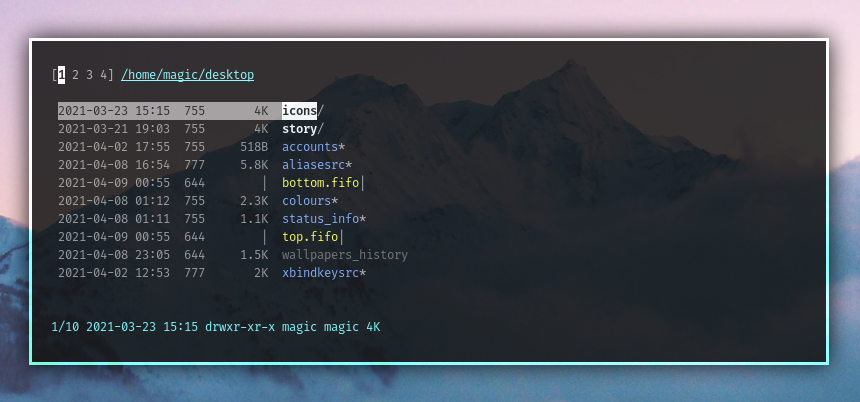

<h1 align="center">st - simple terminal</h1>

st is a simple terminal emulator for X which sucks less.

<h3>Keybinds</h3>

+ **Normal** scroll with mouse and `Alt+Up` and `Alt+Down`
+ Paste `Ctrl+Shift+V`
+ Copy `Ctrl+Shift+C` | TODO: copy with the middle button of mouse
+ When resizing to smaller size, the terminal won't clear the columns | TODO: do the same thing for rows
+ `Shift+Enter` opens a new terminal in the same path
+ 

<h3>Support</h3>

+ coloured undercurl (apply the st.info for external programs)
	- sequence is 4:3, 4:0 to reset
+ history (default: 2000 lines)
+ Emojis
+ 

<h3>Requirements</h3>

In order to build st you need the Xlib header files.

<h3>Installation</h3>

Edit config.mk to match your local setup (st is installed into
the /usr/local namespace by default).

Afterwards enter the following command to build and install st (if
necessary as root):

    make clean install

Then run `tic -x -o ~/.terminfo st.info` to have support in multiple terminal programs that use undercurls, ...

<h3>Fonts</h3>

This was configured with Fira Code and Hack as callback.

## Please verify `github.com/beyondMagic/config`!
